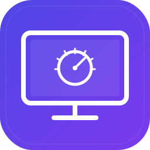

# ScreenDial

<p align="center">
  
</p>

> 디스플레이 프리셋을 원클릭으로 전환하는 macOS 유틸리티

밝기, 색온도, 다크/라이트 모드를 한번에 바꾸려면 시스템 설정 여러 곳을 조작해야 합니다. ScreenDial은 디스플레이 설정 조합을 프리셋으로 저장해두고, 메뉴바에서 이름을 클릭하면 즉시 적용합니다.

## 특징

- **디스플레이 프리셋** — 밝기·색온도·외관 모드를 하나의 프리셋으로 저장
- **원클릭 적용** — 메뉴바에서 프리셋 이름 클릭으로 즉시 전환
- **라이브 편집 프리뷰** — 프리셋 편집 중 슬라이더를 움직이면 실제 화면에 즉시 반영. Cancel/ESC로 편집 진입 시점 상태로 완벽 복원
- **다중 모니터 지원** — 연결된 모든 온라인 디스플레이에 감마/색온도 일괄 적용. 내장 디스플레이와 지원 외장(Studio Display 등)은 밝기도 제어
- **색온도 조절** — 차가운(블루) ↔ 따뜻한(노란) 톤 자유롭게 설정
- **다크/라이트 모드** — 프리셋별로 시스템 외관 모드 지정
- **Revert to Original** — 앱 실행 시점의 디스플레이 상태(밝기·감마·외관)로 언제든 복구
- **프리셋 자유 편집** — 이름·설정값 자유롭게 추가/수정/삭제
- **메뉴바 앱** — Dock 아이콘 없이 메뉴바에서만 동작
- 외부 의존성 없음 (순수 Swift + AppKit + SwiftUI)

## 설치

### Homebrew (추천)

```bash
brew tap oh-research/tap
brew install --cask screendial
```

### 수동 설치

1. [Releases](https://github.com/oh-research/ScreenDial/releases)에서 `.dmg` 다운로드
2. `ScreenDial.app`을 `/Applications`로 드래그
3. 최초 실행 전 Gatekeeper 우회:
   ```bash
   xattr -cr /Applications/ScreenDial.app
   ```
4. 앱을 실행하면 **How to Use** 창이 자동으로 열려 사용법과 권한 설정을 안내합니다

## 메뉴

메뉴바 아이콘을 클릭하면 다음 항목이 표시됩니다:

- *프리셋 목록* — 등록한 프리셋 이름들. 클릭하면 즉시 적용, 현재 프리셋에 ✓ 표시. 활성 프리셋을 다시 클릭하면 실행 시점 상태로 복구
- **Revert to Original** — 앱 실행 시점의 디스플레이 상태(밝기·감마·외관)로 모든 디스플레이 복구
- **Settings...** — 프리셋 관리 및 Launch at Login 토글 (⌘,)
- **How to Use...** — 사용법 + 권한 설정 안내 창
- **About ScreenDial** — 버전·개발자·GitHub 링크 창
- **Quit ScreenDial** — 종료 (⌘Q)

## 사용법

### 프리셋 만들기

1. 메뉴바 아이콘 > **Settings...** 를 엽니다
2. 프리셋 리스트에서 **+** 버튼으로 새 프리셋을 추가합니다
3. 이름, 밝기, 색온도, 외관 모드를 설정합니다

### 프리셋 예시

기본 프리셋 4개가 첫 실행 시 자동 생성됩니다. 이름은 자유롭게 수정 가능하며, 이름 앞이나 뒤에 이모지를 넣을 수 있습니다 (`Ctrl+Cmd+Space` 또는 `fn` 키로 이모지 피커 호출).

| 프리셋 이름 | 밝기 | 색온도 | 외관 모드 |
|------------|------|--------|----------|
| 💼 작업 모드 | 80% | 중립 (0) | Light |
| 🌙 야간 모드 | 30% | +70 (따뜻함) | Dark |
| 🎬 영화 감상 | 40% | +30 (약간 따뜻함) | Dark |
| 📊 프레젠테이션 | 100% | 중립 (0) | Light |

### 적용

메뉴바 아이콘을 클릭하고 프리셋 이름을 선택하면 밝기·색온도·외관 모드가 한번에 바뀝니다.

## 권한

ScreenDial은 하나의 macOS 권한이 필요합니다:

- **손쉬운 사용(Accessibility)** — 다크/라이트 모드 전환에 필요 (AppleScript 자동화)

밝기와 색온도 제어는 권한 없이도 동작합니다. Accessibility 권한이 없으면 외관 모드 전환만 건너뛰고 나머지는 정상 적용됩니다.

첫 실행 시 **How to Use** 창에서 권한 설정을 안내합니다.

## 설정

메뉴바 아이콘 > **Settings...** 에서 변경할 수 있습니다 (⌘,):

- **Launch at Login** — 로그인 시 자동 실행 토글 (창 상단)
- **프리셋 리스트** — 프리셋 추가/수정/삭제, 순서 변경

## 소스에서 빌드

macOS 15+ 및 Swift 6.0이 필요합니다.

```bash
git clone https://github.com/oh-research/ScreenDial.git
cd ScreenDial
swift build
```

## 요구 사항

- macOS 15.0 (Sequoia) 이상

## 삭제

### Homebrew

```bash
brew uninstall --cask screendial
```

### 수동 삭제

```bash
rm -rf /Applications/ScreenDial.app
```

## 기술 스택

- **Swift + AppKit** — 디스플레이 제어, 앱 라이프사이클
- **SwiftUI** — 설정 UI, 온보딩
- **DisplayServices** — 디스플레이 밝기 제어 (내장 + 지원 외장, macOS 14+ 권장 API)
- **CoreGraphics** — 감마 곡선 조절로 색온도 제어
- **AppleScript (NSAppleScript)** — 다크/라이트 모드 전환
- **SPM** — 패키지 빌드

## 라이선스

MIT License
